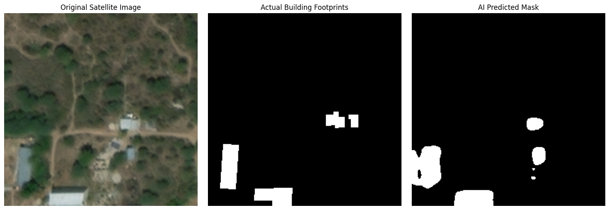
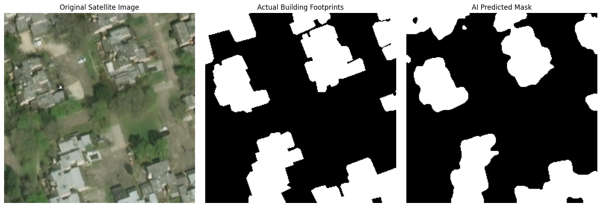
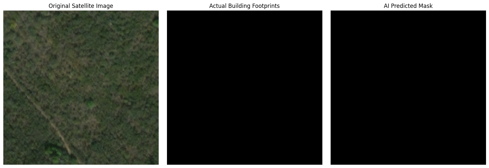
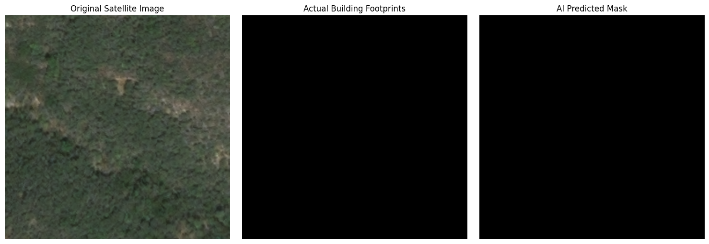

# AI Post-Disaster Damage Mapping 🛰️🏚️

This project utilizes Deep Learning to perform semantic segmentation on high-resolution pre- and post-disaster satellite imagery. The model identifies building footprints and predicts structural damage following natural disasters, automating a process that traditionally takes human analysts hundreds of hours.

## 🧠 Technical Architecture
* **Framework:** PyTorch & Segmentation Models PyTorch (SMP)
* **Architecture:** U-Net
* **Encoder Backbone:** Pre-trained ResNet34 (ImageNet weights)
* **Loss Function:** Combined Dice Loss + Binary Cross Entropy (BCE)
* **Optimization:** Adam Optimizer with `ReduceLROnPlateau` Learning Rate Scheduler
* **Augmentation:** Albumentations (Random Cropping, Flips, Rotations)

## 📊 The Dataset
This model was trained on a subset of the **xView2 Challenge Dataset**. 
* The raw JSON coordinate polygons were programmatically parsed using `shapely` and converted into pixel-perfect binary masks using `OpenCV`.
* *Note: The dataset is not included in this repository due to size constraints. It can be downloaded directly from Kaggle.*

## 👁️ Visual Predictions
Below are examples of the model's predictions on unseen validation data after 30 epochs of training.

## 🚀 How to Run
1. Clone this repository.
2. Download the xView2 dataset from Kaggle and update the `JSON_DIR` and `IMAGE_DIR` paths in the notebook.
3. Install the required dependencies:
   `pip install torch torchvision segmentation-models-pytorch albumentations shapely opencv-python`
4. Run the Jupyter Notebook from top to bottom.
